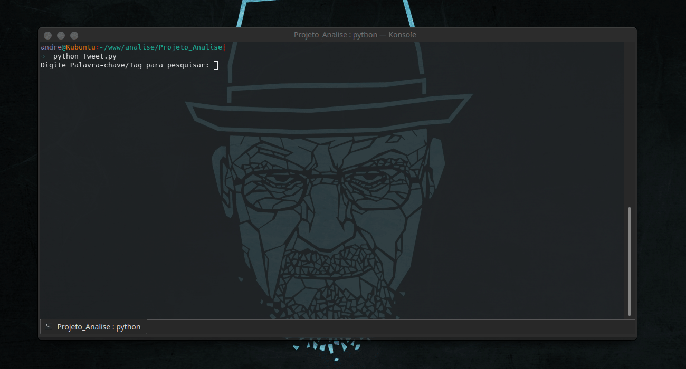
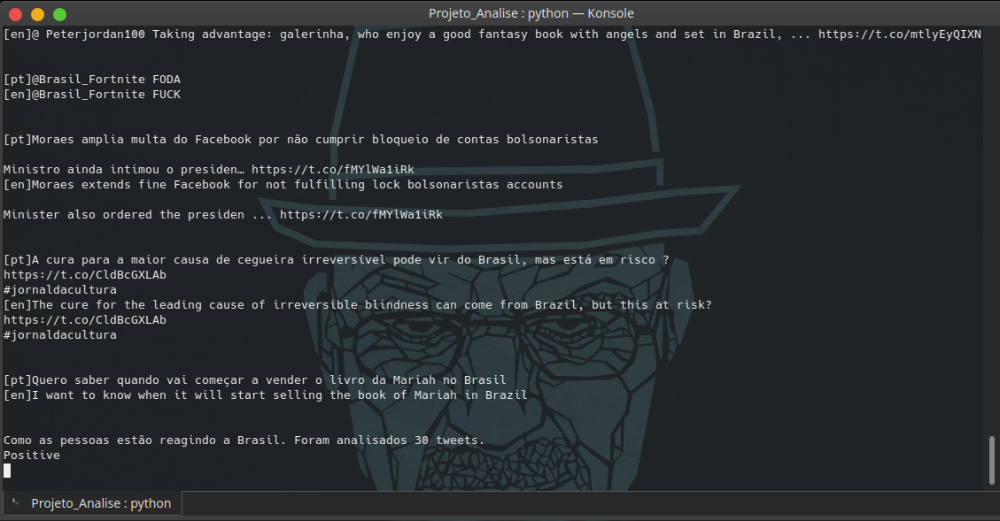
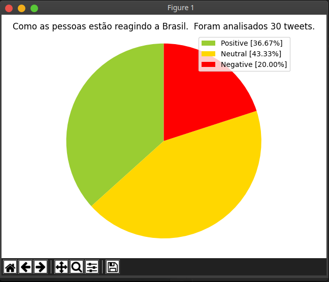
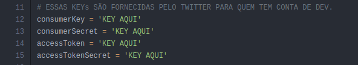

# Análise de sentimentos de tweets (python)


> Aplicação tem objetivo de "pegar" tweets aleatórios do Twitter, e efetuar a análise de como os usuários estão se sentindo em relação a um determinado assunto.

<div>
    
</div>

## Desenvolvido no 3º período do curso de Eng. de Software. (Análise de dados) :books: :mortar_board: 
<div align="center">
    
</div>

<hr>
<div align="center">
    
</div>

## :sparkles: Tecnologias:

[python](https://www.python.org/)
| [TextBlob](https://textblob.readthedocs.io/en/dev/)
| [Google Translate for Python](https://pypi.org/project/googletrans/)
| [Tweepy](https://www.tweepy.org/)
| [Matplotlib](https://matplotlib.org/)
| [UnideCode](https://pypi.org/project/Unidecode/)
| [sys](https://docs.python.org/3/library/sys.html)


## Links para download acima :point_up_2:

<div align="center" name="prints_proj">
    
    
    
</div>

## 💻 Instalação

* É necessário ter instalado em seu computador o **Python** (Caso você não possua link logo acima)

* É necessário também ter uma conta de desenvolvedor no twitter.
    <br> Caso não possua aqui está o link: [Twitter-Developer](https://developer.twitter.com/en)

* Faça o clone do projetos no local desejado.
    ```sh
        git clone https://github.com/Alencar26/Analisador-de-Sentimentos-em-python.git
    ```

<br>

1. Abra o terminal da sua máquina, vá para um diretório da sua preferênca;

2. Você ira criar um *Virtual Environments* (Ambiente Virtual);
<br><br> MacOs e Linux:

    ```sh
        python3 -m venv analise

        # dependendo da versão do python use:
        python -m venv analise
    ``` 
    <br> Windows:

    ```cmd
        py -m venv analise
    ```
<br>

3. Agora vamos ativar o Ambiente Virtual;
<br><br> MacOs e Linux:

    ```sh
        source analise/bin/activate
    ``` 
    <br> Windows:

    ```cmd
        .\analise\Scripts\activate.bat
    ```
    Pronto agora você estácom o ambiente ativo.

4. Agora vamos atualizar o gerenciador de pacotes do python (**pip**)
<br><br> MacOs e Linux:

    ```sh
        pip install -U pip
    ``` 
    <br> Windows:

    ```cmd
        py -m pip install -U pip
    ```
    Ok. Após tudo configurado vamos ao projeto!

5. Abra sua IDE ou Editor de preferência no local onde foi clonado o projeto.

6. Substitua os campos a seguir pelas Keys fornecida pelo twitter;

    <div align="center">
        
    </div>

7. instalando dependencias importantes:

    - Tweepy
        ```sh
            pip install tweepy
        ```
    - Google Translate
        ```sh
            pip install googletrans
        ```
    - UnideCode
        ```sh
            pip install Unidecode
        ```
    - TextBlob
        ```sh
            pip install textblob
        ```
    - Matplotlib
        ```sh
            pip install matplotlib
        ```

8. Agora basta executar o programa
    ```sh
        python Tweet.py
             #ou
        py Tweet.py
    ```
<br>

# Agora é só analisar o que estão tweetando!

<div align="center">
    
</div>

# LICENCE

<br>
Projeto sob licença <a href="./LICENSE">MIT.</a>